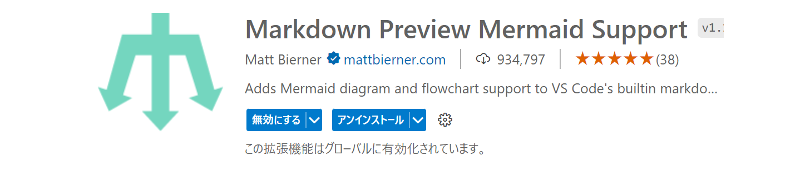

# VSCodeでmermaidを利用する方法や便利な拡張機能

1. 拡張機能をインストール

- Visual Studio Code で Markdown Preview Mermaid Support をインストールします。

- 検索すると以下のような画面で見つけることができます。

- ちなみに、github.dev の Visual Studio Code にもこの拡張機能をインストールできます。

1. Mermaid Markdown の書き方

- まず、Visual Studio Code で .md ファイルを作成します。

- その後、以下のようにmermaidをキーワードにしてコードを記述します。

~~~

~~~
- このコードは上から下へ記述するフローチャートで、この拡張機能でプレビューすると以下のようになります。

- 画面全体を出すと、こんな感じです。

Mermaid Markdown はこちら
>https://mermaid.js.org/#/

## 便利な拡張機能

Mermaid記法をプレビューに表示する
>[Markdown Preview Mermaid Support](https://marketplace.visualstudio.com/items?itemName=bierner.markdown-mermaid)

Mermaid記法をハイライト表示
>https://marketplace.visualstudio.com/items?itemName=bpruitt-goddard.mermaid-markdown-syntax-highlighting

Mermaid記法で表示される図を画像やPDFに出力
>https://marketplace.visualstudio.com/items?itemName=yzane.markdown-pdf

Mermaid記法で表示される図をスライドに出力
>https://marketplace.visualstudio.com/items?itemName=marp-team.marp-vscode

引用元のサイトはこちら
>https://usefuledge.com/vscodemermaidsupport.html#toc6
>https://qiita.com/sato_kana/items/2a13f19017576488f017