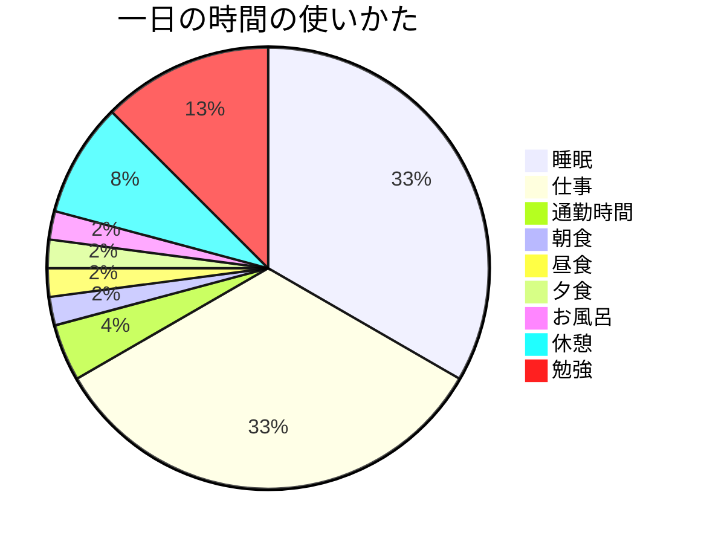
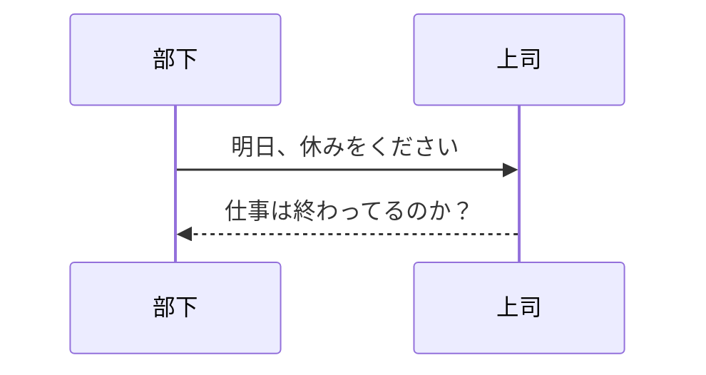

# mermaidで記述できるダイアグラムの記述例とコード 
1. 円グラフ
~~~

```mermaid
pie
    title 一日の時間の使いかた
    "睡眠" : 8
    "仕事" : 8
    "通勤時間" : 1
    "朝食" : 0.5
    "昼食" : 0.5
    "夕食" : 0.5
    "お風呂" :  0.5
    "休憩" :  2
    "勉強" :  3
```
~~~

```mermaid
pie
    title 一日の時間の使いかた
    "睡眠" : 8
    "仕事" : 8
    "通勤時間" : 1
    "朝食" : 0.5
    "昼食" : 0.5
    "夕食" : 0.5
    "お風呂" :  0.5
    "休憩" :  2
    "勉強" :  3
```
2. シーケンス図のサンプル
~~~

```mermaid
sequenceDiagram
    部下->>上司: 明日、休みをください
    %% this is a comment
    上司-->>部下: 仕事は終わってるのか？
```
~~~

```mermaid
sequenceDiagram
    部下->>上司: 明日、休みをください
    %% this is a comment
    上司-->>部下: 仕事は終わってるのか？
```
引用元のサイトはこちら
>https://usefuledge.com/vscodemermaidsupport.html#toc6

