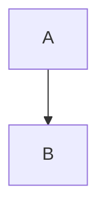
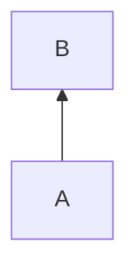
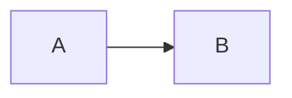
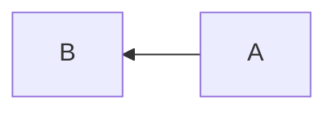

# mermaidで記述できるダイアグラムチュートリアル
mermaidでフローチャートの記述のしかたを説明します

## 初めに
フローチャートの作業要素をノードと呼ぶ

## 方向を決める方法
・上から下の場合
graph TB　か　graph TD
```
graph TB
    A --> B
```

・下から上の場合
graph BT
```
graph BT
    A --> B
```

・左から右の場合
graph LR
```
graph LR
    A --> B
```



・右から左の場合
graph RL
```
graph RL
    A --> B
```


## ノードの中に文字を出力する方法
1. ノードをかきます。
2. 
    ```
    graph TB
    A
    ```
    ```Mermaid
    graph TB
    A
    ```
3. ノードに文字を格納します。
    ```
    graph TB
    A["Hello"]
    ```
    ```Mermaid
    graph TB
    A["Hello"]
    ```
## ノードの形を変える方法

## 1
円形にしたい場合
円形no
場合は(("A"))のようにします。
```
graph TB
A(("Hello"))
```
```Mermaid
graph TB
A(("Hello"))
```